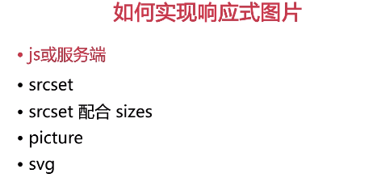
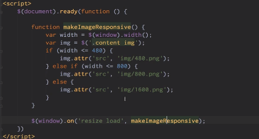
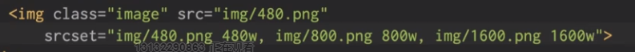
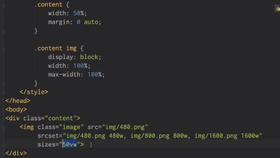
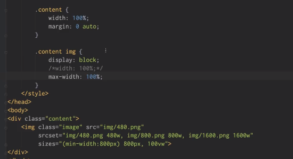
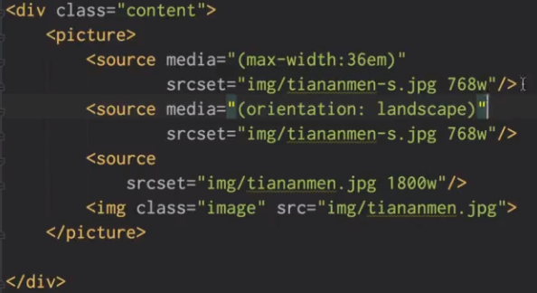

# 简介
学习页面响应式处理方案如:[font-size+rem](http://www.cnblogs.com/lyzg/p/4877277.html)、[Flex布局](http://www.ruanyifeng.com/blog/2015/07/flex-grammar.html?utm_source=tuicool)、[以视口为基准的vh和vw单位](https://github.com/chokcoco/iCSS/issues/15)

## 响应式静态页面
1. 响应式页面设计原则：优雅降级

    - 渐进增强：先构建基本效果，然后针对不同浏览器，添加和实现不同效果（先是可用，然后再好看）
    - 优雅降级：先实现最终效果，然后哪些浏览器没有哪些功能，去掉哪些效果，逐渐降级（先在最新浏览器实现功能，再对老旧浏览器进行修修补补，如果不支持，最终降级不实现）

2. px、em、rem区别
  
    - px是绝对单位，一般设置body的font-size为12px或者14px
    - em是相对单位，相对参照物为父元素的font-size。当父元素没有设置的情况，默认1em=16px
    - rem是相对单位，相对参照物为根元素html的font-size.当body元素没有设置的情况，默认1rem=16px
    - body设置font-size:100% -->1rem=16px，所以当body设置font-size:62.5% --> 1rem=10px（10/16*100%）

3. width设置百分比
   为了达到响应式缩放，最外层包含框width应该设置百分比形式

4. html页面meta设置

    - 强制以最新的IE浏览器模式渲染页面。IE11已经弃用了
    ```sh
      <meta http-equiv="x-ua-compatible" content="ie=edge">
    ```

    - 理想视口设置【布局视口=可视视口】
    ```sh
      <meta name="viewport" content="width=divice-width,initial-scale=1">

      initial-scale=1.0指的是初始缩放比例，即不缩放
      minimum-scale=1.0指的是最小的缩放比例
      maximum-scale=1.0指的是最大的缩放比例
      user-scalable=no指的是禁用用户缩放
    ```

    - html的endif用法【lt< ，lte<= ，gt> ，gte>= 】
    ```sh
        <!--[i f lte IE 8]>
        <p class="browserupgrade">您的浏览器版本低于IE8版本,请到<a href="http://browsehappy.com">这里</a> 更新，以获取最佳的体验</p>
        <![endif]-->
    ```

5. 响应式图片有以下处理方法<br>

    <br><br>
    - 法一：JS方法<br><br>
       <br><br>
    - 法二：srcset【文件路径，描述，逗号】<br><br>
       <br><br>
    - 法三：srcset配合sizes<br><br>
       <br><br>
       sizes第一个值是媒体查询，可以省略。<br>
       sizes第二个值代表图片预估的尺寸,50vw代表所有情况图片预估大小都是50%的视口宽度。<br><br>
       <br><br>
       sizes第一个值代表媒体查询下超出800px，宽度为800px。其余为自适应。<br>
       sizes第二个值代表图片预估的尺寸,100vw代表所有情况图片预估大小都是100%的视口宽度<br><br>
    - 法四：picture<br><br>
       <br><br>
       需要用到picturefill：浏览器不支持picture的话，会用一些替代的方案实现。
    - 法五：svg<br>
       定义：可缩放的矢量图形<br>
       优点：基于绘制规则，缩放也不会改变失真<br>
       缺点：和位图相比缺点是很难表现色彩丰富和逼真
